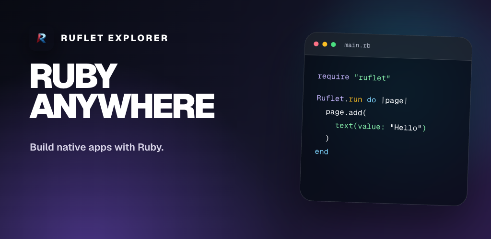
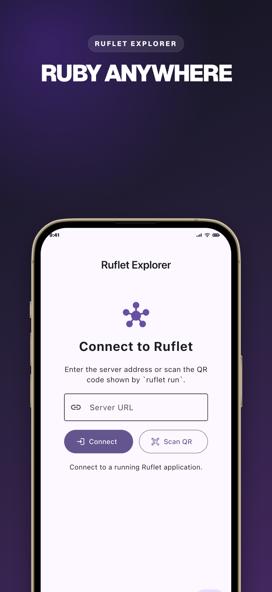
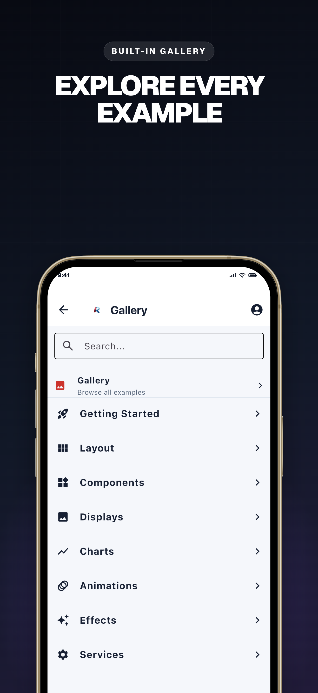
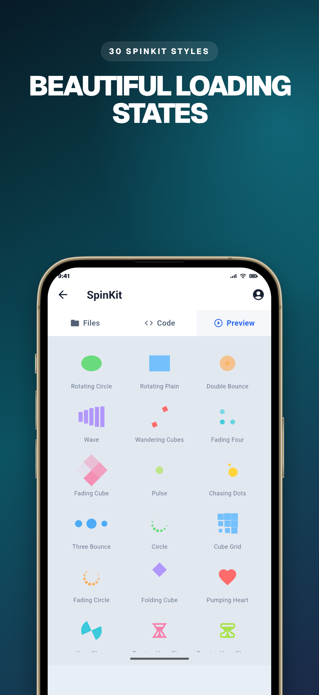
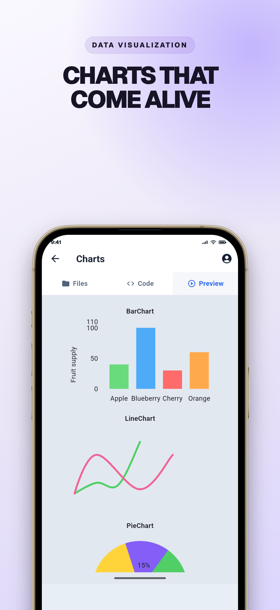

<div align="center">



# Ruflet Explorer

### Your Ruby app, on a real device, in seconds.

**Edit `main.rb` → `ruflet run` → scan → it's live in your hand.**

Ruflet Explorer is the preview client for Ruflet apps. Install it once and every
Ruby app you write runs on the device immediately — nothing to compile, nothing
to sign, nothing to install again. If you've used Expo Go for React Native, this
is that loop, for Ruby.

[](#-build)
[](#-project-layout)
[](services.yaml)
[](ruflet.yaml)
[](studio/)

</div>

---

## 📱 See it

<div align="center">






<sub>Connect · Browse the gallery · Run live components · Render charts</sub>

</div>

---

## ✨ What it does

Ruflet Explorer is written **entirely in Ruby** — every screen, every control, every
route. There is no hand-written Dart, Kotlin, or Swift in this project. It is Ruflet
dogfooding itself: the app that runs your Ruflet apps is a Ruflet app.

| | |
|---|---|
| 🔗 **Connect by URL** | Type `http://192.168.1.20:8550` — scheme, port, and localhost rewriting are handled for you |
| 📷 **Scan to connect** | Camera scanner with torch and camera-switch, reading the QR printed by `ruflet run` |
| 🧭 **Live rendering** | The remote app loads through Ruflet's `ruflet_app` control with auto-reconnect |
| 🎨 **Studio on board** | A launcher FAB opens a bundled Ruflet Studio — 68 runnable example apps with source |
| ♻️ **One VM** | Explorer and Studio share a single embedded Ruby VM; Studio's hub FAB returns home |

URL normalization is deliberately forgiving: it accepts bare hosts, upgrades `ws`/`wss`
to `http`/`https`, picks `http` for IPs and localhost, and rewrites loopback addresses to
`10.0.2.2` on Android emulators.

---

## 🚀 Run

```bash
ruflet run main.rb
```

Skip the launcher and connect straight to a server:

```bash
RUFLET_URL=http://192.168.1.20:8550 ruflet run main.rb
```

---

## 🧪 Tests

```bash
ruby test/url_test.rb
```

```bash
ruby test/app_test.rb
```

```bash
ruby test/standalone_apps_test.rb
```

- `url_test.rb` — scheme inference, port handling, IPv6, Android loopback rewriting
- `app_test.rb` — launcher, scanner, and connection view construction
- `standalone_apps_test.rb` — every bundled Studio example still loads

---

## 📦 Build

Always use **self-contained mode** so the Ruby launcher is embedded in the native app:

```bash
ruflet build apk --self
```

```bash
ruflet build aab --self
```

```bash
ruflet build ios --self
```

---

## 🗂️ Project layout

```
main.rb                  entry point → RufletExplorer::App
ruflet.yaml              extensions, assets, per-platform icon/splash config
services.yaml            app identity + permission rationale
lib/ruflet_explorer/
  app.rb                 launcher, scanner, and connection views
  url.rb                 URL parsing and normalization
  qr_scanner_control.rb  QR scanner control wrapper
  studio.rb              embeds Studio into the shared page
studio/                  vendored Ruflet Studio (do not edit)
test/                    minitest suites
release_assets/          store screenshots and their generator
```

---

## 🖼️ Store assets

Production screenshots and the Google Play feature graphic live in
[`release_assets/`](release_assets/README.md), alongside the editable generator used to
produce them.
